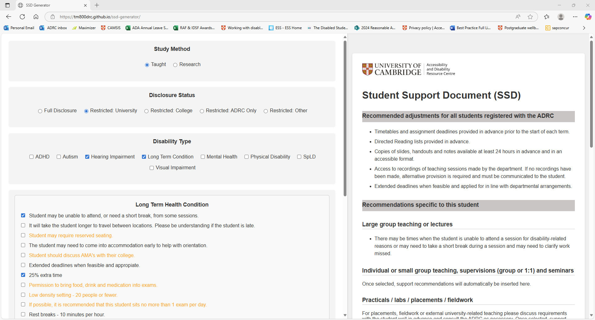
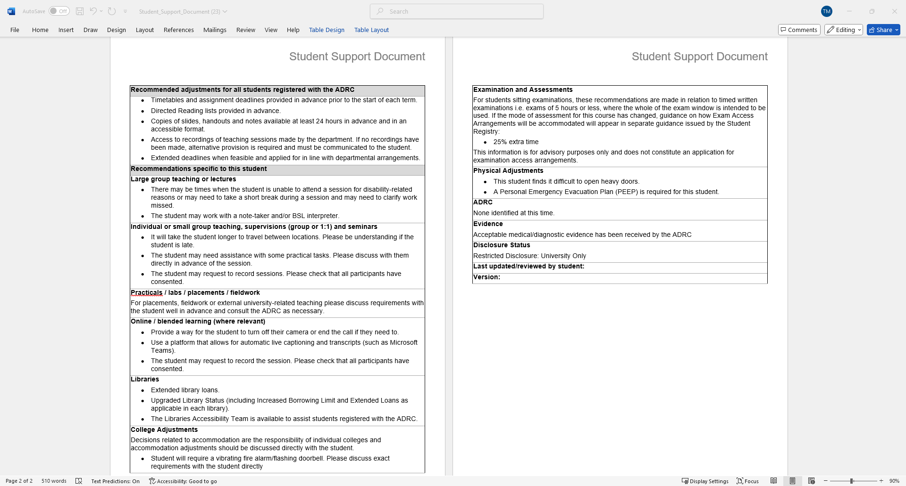

# Student Support Document Generator (SSD Generator)

A web-based tool designed to assist university disability advisers in generating tailored Student Support Documents (SSDs) for disabled students based on study mode, disclosure level, and specific support needs.

This project was built as a practical solution for the Accessibility and Disability Resource Centre (ADRC) at the University of Cambridge, and serves as a personal portfolio project to demonstrate my skills in web development, accessibility, and user-focused design - created without prior professional experience in the field.

---

# Project Purpose

Disability advisers spend a significant amount of time manually writing SSD's which becomes more time consuming and complex when a student has multiple disabilities. This tool streamlines the process and reduces human error.

## Live Demo

[View the live site](https://Tm800drc.github.io/ssd-generator)

---

## Features

- Select **study mode** (Taught / Research)
- Choose **disclosure level**
- Filter support options by **disability category**
- Prevents duplication of support recomendations by disabling options already checked elsewhere
- Toggle support options to generate a live preview
- Generate a downloadable, professionally formatted **Word document**
- Automatically formats structured support content (headings, bullets, etc.)
- Highlights enhanced adjustments in orange as they are only for use when recommended by medical professionals
- Clean, accessible user interface built with **Vite + vanilla JS + HTML/CSS**
- Fully client-side: No data is saved or transmitted. The program is fully GDPR compliant.
- Designed for clarity, accessibility and ease of use

---

## Screenshots

Main interface with options selected:



Example of generated Word document:



---


## Tech Stack

| Frontend         | Build Tool | Document Export  | Hosting        |
|------------------|------------|------------------|----------------|
| HTML5, CSS3, JS  | Vite       | docx (npm)       | GitHub Pages   |

## Running Locally

To run the project locally, use the following commands:

```
git clone https://github.com/Tm800drc/ssd-generator.git
cd ssd-generator
npm install
npm run dev
```

Then open http://localhost:5173 in your browser.

To build for production:

```
npm run build
```

## Folder Structure

```plaintext
ssd-generator/
│
├── index.html             # Main HTML structure
├── vite.config.js         # Vite configuration for GitHub Pages
├── public/                # Static assets (logo, etc.)
├── src/
│   ├── main.js            # Entry point
│   ├── script.js          # UI rendering and state handling
│   ├── docGenerator.js    # Word document export logic using docx
│   ├── layouts.js         # Layout templates
│   ├── supportOptions.js  # All support option definitions
│   ├── disclosureLevels.js
│   └── style.css         # Custom styling
```

## About Me

I'm an Assistant Disability Adviser with a strong interest in accessibility and user-focused digital tools. This is my first full web project, built entirely from scratch using JavaScript, HTML, CSS, and Vite — with no outside coding support.

The idea for this tool was my own, developed independently in response to a real operational need. I designed, coded, and deployed it myself, regularly updating senior colleagues and the head of department on progress. I'm the only coder in my team and had to take full ownership of both the technical and user experience aspects of the build.

Since implementation, the SSD Generator has reduced time spent on document creation by approximately 45%, allowing advisers to process cases more efficiently and therefore spend more time on complex student needs and collaborative casework. It is now in daily use by the Accessibility and Disability Resource Centre at the University of Cambridge.

## License

This project is not open source. No permission is granted for reuse, redistribution, or modification of the code or content. It is published publicly for portfolio and demonstration purposes only.

## Acknowledgements

- The docx npm library (https://www.npmjs.com/package/docx) for enabling Word document generation in-browser
- Colleagues at the ADRC for their feedback and encouragement during development
